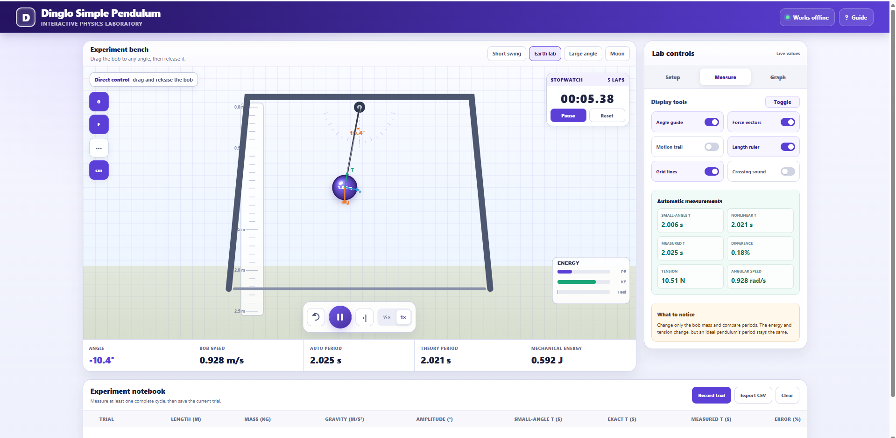
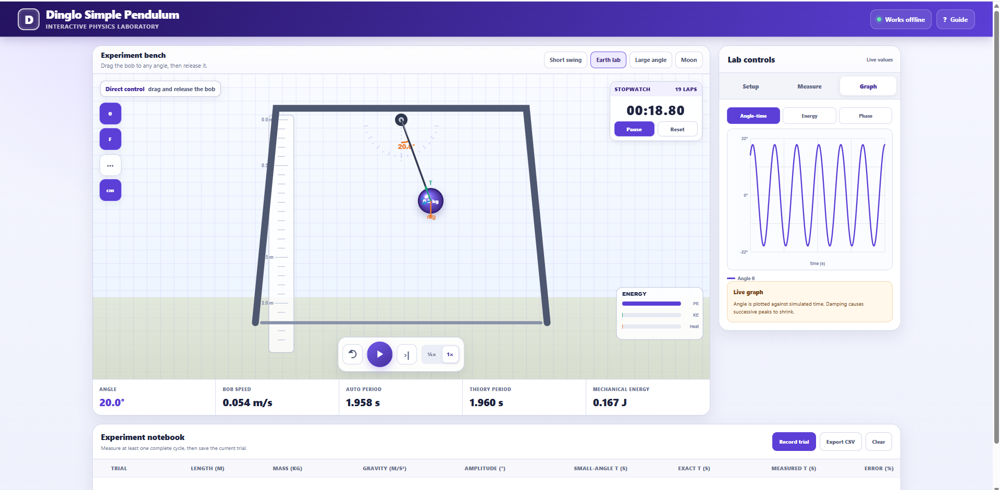

# Dinglo Simple Pendulum Simulator

[](CONTRIBUTING.md)

<p align="center">
  <strong>Interactive Physics Laboratory</strong><br>
  A browser-based virtual laboratory for exploring simple pendulum motion through direct experimentation, live measurements and real-time graphs.
</p>



## Overview

The Dinglo Simple Pendulum Simulator turns the standard pendulum experiment into an interactive digital laboratory. Learners can drag and release the bob, change experimental conditions, measure the motion and compare observed results with theoretical predictions.

The simulator is designed for classroom demonstrations, practical sessions, independent study and physics revision. It combines an animated experiment bench with measurement tools, force visualisation, automatic calculations, graphs and a reusable experiment notebook.

## Main Features

| Area | Included tools |
| --- | --- |
| Direct interaction | Drag-and-release pendulum bob, play, pause, reset and step controls |
| Experiment presets | Short swing, Earth laboratory, large-angle motion and Moon gravity |
| Adjustable setup | Pendulum length, bob mass, gravity, release angle and damping |
| Measurement | Stopwatch, lap counter, length ruler, angle guide and automatic period measurement |
| Visualisation | Force vectors, motion trail, grid lines, energy bars and crossing sound |
| Live calculations | Angle, bob speed, period, tension, angular speed and mechanical energy |
| Theory comparison | Small-angle period, nonlinear period, measured period and percentage difference |
| Graphs | Angle–time, energy and phase views |
| Experiment records | Record trials, compare measurements, clear results and export data as CSV |
| Accessibility | Responsive interface and offline operation |

## Measurement Workspace

The measurement view displays the physical quantities required for a complete pendulum practical. Learners can follow the angle, velocity, force vectors, tension, period and energy while the pendulum is moving.


## Live Graphing

The graph workspace plots the simulation continuously. The angle–time graph makes oscillation period, amplitude and damping visible, while the energy and phase views support deeper analysis of the system.



## Physics Model

For an ideal pendulum of length **L**, released through a small angle in a gravitational field **g**, the theoretical period is:

```text
T₀ = 2π√(L/g)
```

The simulator also accounts for nonlinear motion at larger angles, where the small-angle approximation becomes less accurate. The motion is governed by:

```text
d²θ/dt² + (g/L)sin(θ) = 0
```

The central experimental predictions are:

- Increasing the pendulum length increases the period.
- Increasing gravitational acceleration decreases the period.
- Changing the bob mass does not change the period of an ideal simple pendulum.
- At large release angles, the measured period differs from the small-angle prediction.
- Damping reduces the amplitude and mechanical energy over time.

## Typical Experiment Workflow

1. Select a preset or configure the pendulum variables.
2. Drag the bob to the required release angle.
3. Release the bob and allow it to oscillate.
4. Use the stopwatch or automatic measurement tools to determine the period.
5. Compare the measured period with the small-angle and nonlinear predictions.
6. Record the trial in the experiment notebook.
7. Repeat the experiment after changing one variable.
8. Export the completed results as a CSV file for analysis.

## Suggested Investigations

### Effect of pendulum length

Keep mass, gravity and release angle constant. Change the length and determine how **T²** varies with **L**.

### Effect of bob mass

Keep length, gravity and amplitude constant. Change only the mass and compare the measured periods.

### Small-angle approximation

Repeat the experiment at progressively larger release angles. Compare the small-angle period with the nonlinear and measured periods.

### Earth and Moon comparison

Use the Earth laboratory and Moon presets with the same length and amplitude. Investigate the effect of gravitational acceleration on the period.

### Energy transformation

Observe the potential-energy and kinetic-energy bars throughout a complete oscillation. Identify the positions of maximum potential energy and maximum kinetic energy.

## Learning Outcomes

After using the simulator, a learner should be able to:

- describe the motion of a simple pendulum;
- determine the period from repeated oscillations;
- investigate the relationship between period, length and gravity;
- explain why the bob mass does not affect the ideal period;
- distinguish between small-angle and nonlinear predictions;
- interpret angle–time, energy and phase graphs;
- identify tension, weight and velocity during the motion;
- record, compare and export experimental results.

## Project Information

**Product:** Dinglo Simple Pendulum Simulator  
**Category:** Interactive physics laboratory  
**Developer:** Mangena Kegorapetse  
**Brand:** Dinglo  
**Version:** 1.0  
**Year:** 2026

## Rights

Copyright © 2026 Mangena Kegorapetse. All rights reserved.

Dinglo, its interface design, visual identity, documentation and simulator assets may not be copied, redistributed or sold without written permission from the developer.

## Contributing

Bug reports, physics-validation notes, accessibility improvements and documentation corrections are welcome. Read [CONTRIBUTING.md](CONTRIBUTING.md) before proposing a change. Contributions do not grant permission to redistribute or resell the complete simulator.
